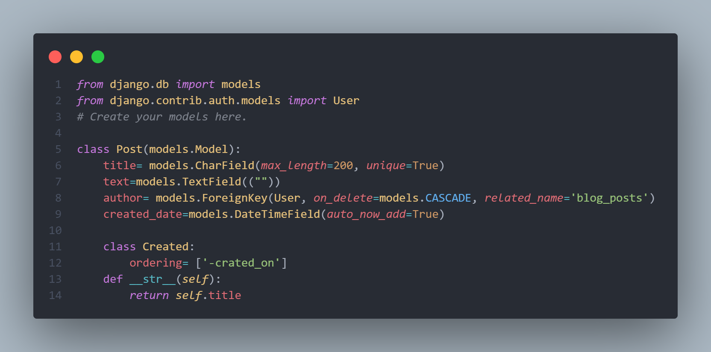
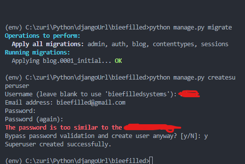
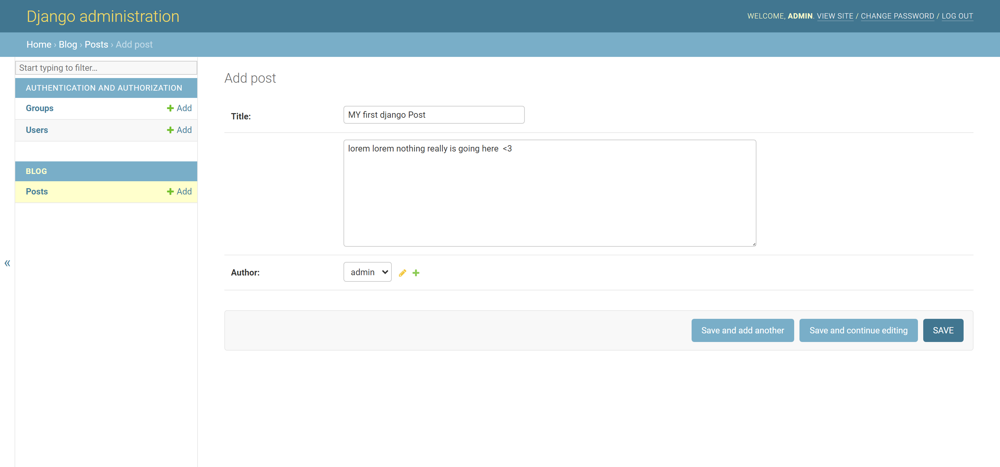
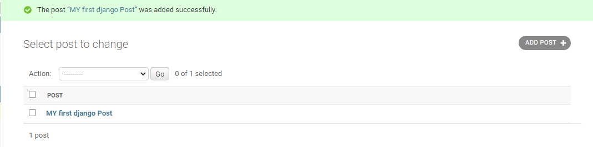

# Django Url

-Tasks

1. create new virtual environment
2. create a new Django project and a blog app
3. creating super admin
4. create blog app models
5. changing admin Url to Zuri-admin.

-Snapshots below

-task completed
